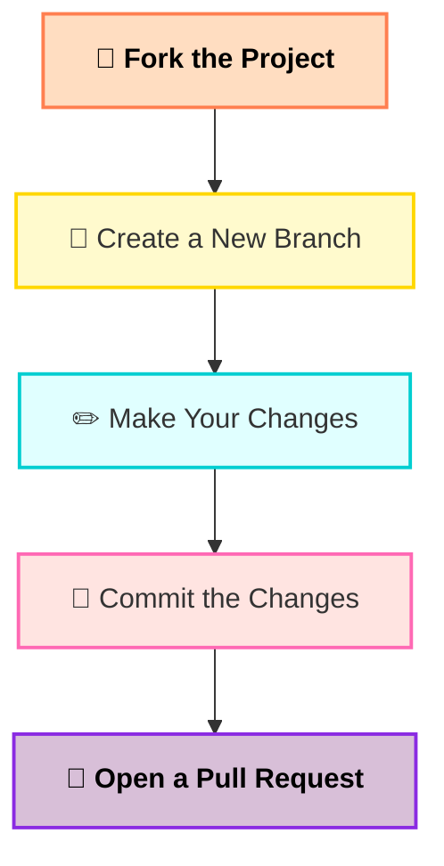

<h1 align="center">✨ Hacktoberfest 2025 Contributions ✨</h1>

Welcome — this repository collects beginner-friendly frontend projects and tasks for Hacktoberfest 2025. If you're new to open source, you're in the right place! 🚀

---

## Table of Contents
- [About](#about)
- [Project Goal](#project-goal)
- [Why Contribute](#why-contribute)
- [Tech Stacks](#tech-stacks)
- [How to Contribute](#how-to-contribute)
- [Per-project notes](#per-project-notes)
- [PR checklist](#pr-checklist)
- [Code of Conduct & License](#code-of-conduct--license)

---

## About
Hacktoberfest is a month-long celebration of open-source software. Contribute to public repositories on GitHub to earn swag and learn collaboration skills. Learn more at https://hacktoberfest.com

## Project Goal
- Provide a beginner-friendly repo for Hacktoberfest
- Encourage practice in frontend development, UI/UX, and adding functionality
- Create a collection of polished websites and small apps by contributors

## Why Contribute
- Beginner-friendly issues and clear guidance
- Work with small, real frontend projects (React, Vite, Next.js)
- Improve your JS/CSS/React/Tailwind skills
- Earn a place in the CONTRIBUTORS list when your PR is merged

## Tech Stacks You Can Use
- React.js
- JavaScript / TypeScript
- Tailwind CSS
- Bootstrap
- Vanilla CSS / HTML

---

## How to Contribute
1. Fork this repository on GitHub (click "Fork" in the top-right).
2. Clone your fork locally:

```powershell
git clone https://github.com/RazaJavaid2004/hacktoberfest2025-contributions.git
cd hacktoberfest2025-contributions
```

3. Create a branch for your work:

```powershell
git checkout -b yourname/feature-description
```

4. Make your changes. Keep commits small and focused.
5. Push your branch and open a Pull Request from your fork to this repository.

Notes:
- Add a clear PR description explaining what changed and why.
- If you update or add a project, include simple run instructions in that project's folder (README or comments).

---

## Per-project notes
This repo contains several small projects (see folders like `CartWithRTK`, `CodeWithJs`, `js-practice-platform`, etc.). Each project may have its own setup. Typical steps inside a project folder:

```powershell
cd CartWithRTK
npm install
npm run dev
```

If a project uses Next.js or another framework, follow that project's README inside its folder.

---

## PR checklist
- [ ] The change is limited in scope and well-documented
- [ ] The project builds and runs locally (if applicable)
- [ ] No console.log left in production code
- [ ] Commit messages are clear and atomic
- [ ] If you added a new project or major feature, add a short README in that folder with run instructions

---

## Code of Conduct & License
This repository follows the guidelines in `CODE_OF_CONDUCT.md`. By participating, you agree to this code of conduct.

License: see `LICENSE` at the repo root.

---

Thanks for contributing — let's make great things together! 🎯
<p align="center">
  
</p>

<p align="center">
  <b>🚀 A collaborative open-source initiative for Hacktoberfest 2025! 💻</b><br>
  Learn • Build • Contribute • Celebrate 🎉
</p>

<div align="center">
  
[](https://github.com/recodehive/recode-website/stargazers)
[](https://github.com/recodehive/recode-website/network/members)
[](https://github.com/recodehive/recode-website/pulls)
[](https://github.com/recodehive/recode-website/issues)
[](https://github.com/recodehive/recode-website/graphs/contributors)

</div>

---

## 📜 Table of Contents
- [About](#-about)
- [Features](#-features)
- [Quick Start](#-quick-start)
- [Tech Stack](#-tech-stack)
- [Project Structure](#-project-structure)
- [Contributing](#-contributing)
- [Community](#-community)
- [Project Statistics](#-project-statistics)
- [Contributors](#-contributors)
- [Stay Connected](#-stay-connected)

---

## 📖 About

Hacktoberfest is a month-long celebration of open-source software run by DigitalOcean.  
Contribute to any open-source repo on GitHub and earn cool swag & a T-shirt 👕.  

---

## ✨ Features

- **Hands-On Setup Guides** – Practical walkthroughs for setting up projects, repositories, and development environments  
- **Leaderboards & Challenges** – Track your progress, earn points, and compete with others to stay motivated  
- **Community & Collaboration** – Engage with other learners, share tips, and collaborate on projects  

---

## 🚀 Quick Start

### Prerequisites

- [Node.js](https://nodejs.org/) ≥ 18   

### Installation

**Clone the repository:**
```bash
https://github.com/Nikhil-2002/hacktoberfest2025-contributions.git
cd AnyFolder

Traditional Setup:

bash
Copy code
cd AnyFolder
npm install
npm run dev


📁 Project Structure

HACKTOBERFEST2025-CONTRIBUTIONS/
│
├── CartWithRTK/
│ ├── node_modules/
│ ├── public/
│ └── src/
│
├── CodeWithJs/
├── Cointab/
├── FindNearestMess/
├── HealthcareAssignment/
├── js-practice-platform/
│
├── .gitignore
├── CODE_OF_CONDUCT.md
├── CONTRIBUTORS.md
├── LICENSE
├── README.md
├── package-lock.json
└── package.json

## 🤝 Contributing

We welcome contributions from developers of all skill levels! Here's how you can get started:

```

## 🤝 Contributing

We welcome contributions from developers of **all skill levels**!  
Follow these simple steps to start contributing to Hacktoberfest 2025 🎉

---

### 📝 Contribution Steps

<div align="center">



### Step-by-Step Guide

**Fork the repository** on GitHub

**Clone your fork:**

```bash
git clone https://github.com/your-username/hacktoberfest2025-contributionse.git
cd AnyFolder
```

**Create a new branch:**

```bash
git checkout -b feature/your-feature-name

```

**Make your changes** and test thoroughly

**Commit your changes:**

```bash
git commit -m "Add: brief description of your changes"
```

**Push to your fork:**

```bash
git push origin feature/your-feature-name
```

**Submit a Pull Request** with a detailed description of your changes


<div align="center">


**Happy open-source contributions—here's to your career success! 🎉**


</div>